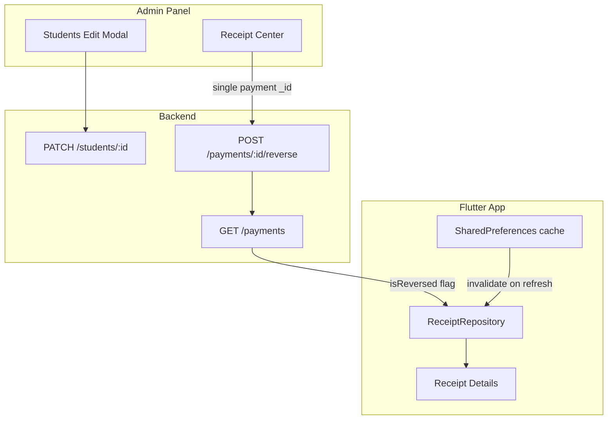

# Transport Update, Receipt Reversal, and App Sync Plan

## Problem Summary

| Issue | Root cause |
|-------|------------|
| Transport `None` → zone fails | [`StudentService.updateStudent`](backend/src/services/StudentService.js) runs ledger sync inside a MongoDB transaction; missing `TransportFeeStructure` throws **after** `$set`, rolling back the whole update. Errors are hidden in admin UI. |
| Receipt Center reversal fails | Receipt Center ([`App.tsx`](admin-frontend/src/App.tsx) `receipts` case) has **no per-line reversal UI** — it calls `reversePayment(t.reversalIds \|\| t.id)`, reversing the **entire batch**. Fallback `t.id` is a receipt UUID (`transactionId`), not a payment `_id` → 404. Failures are only `console.error` with no user feedback. |
| App not updating after reversal | Receipts are **derived client-side** from payment rows ([`receipt_repository.dart`](FlutterProject/lib/data/repositories/receipt_repository.dart)); originals stay after reversal, so old receipts remain visible. 5-minute caches and pull-to-refresh without `forceRefresh` keep stale data. |

Your preference for partial batch reversals: **revised receipt** — show the same receipt group with only still-valid payments and a recalculated total (not delete-and-resend).

---

## Architecture (current vs target)



---

## Fix 1 — Transport update (`None` → `Railnagar` / `Outside Railnagar`)

### Backend changes in [`StudentService.updateStudent`](backend/src/services/StudentService.js)

1. **Validate prerequisites before mutating** — if `newTransport !== 'None'`, confirm an active `TransportFeeStructure` exists; return a clear 400/404 **before** starting the transaction (or commit the student field update even if ledger sync fails — prefer validating first so admin gets an actionable message).

2. **Auto-create TRANSPORT `FeeCategory`** — mirror [`createStudent`](backend/src/services/StudentService.js) (lines 80–88) so ledger sync is never silently skipped when the category is missing.

3. **Use remaining months** — add `transportMonths` to [`updateStudentSchema`](backend/src/validations/student.schema.js) (`z.coerce.number().int().min(0).max(12).optional()`). When going from `None` to a zone mid-year, create ledgers only from **current month through May** (using `transportMonths` sent by admin UI), not all 12 months from admission month.

4. **Scope ledger queries by `academicYear`** — filter `existingLedgers` by active academic year to avoid touching wrong-year records.

5. **Add test** — extend [`transportAndPaymentsBatch.test.js`](backend/src/tests/transportAndPaymentsBatch.test.js) with `None → Railnagar` on a student with no prior transport ledgers.

### Admin frontend changes

- [`store.tsx`](admin-frontend/src/store.tsx) `updateStudent`: parse `res.json()` on failure and return `{ success, error }` (same pattern as `addStudent`).
- [`Students.tsx`](admin-frontend/src/components/Students.tsx) `handleEditSubmit`: show backend error text instead of generic `"Failed to update student"`.
- Optional guard: if no active transport fee structure exists for selected zone, show inline warning before save.

---

## Fix 2 — Receipt Center per-line reversal

### Admin store [`store.tsx`](admin-frontend/src/store.tsx)

1. **Correct reversal status detection** — build a set of reversed payment IDs from raw transactions:
   ```js
   const reversedIds = new Set(
     rawTransactions
       .filter(tx => tx.isReversal && tx.details?.reversalOf)
       .map(tx => String(tx.details.reversalOf))
   );
   ```
   Mark each payment/subItem `status: 'REVERSED'` when its `_id` is in `reversedIds` (not from ledger status).

2. **Always populate `subItems`** — even for single-payment receipts, so Receipt Center can reverse one line consistently. Use `tx._id || tx.id` when building `reversalIds` and subItem IDs.

3. **Harden `reversePayment`**:
   - Accept a **single** payment Mongo `_id` (not comma-separated batch by default).
   - Parse error body on `!res.ok` and `alert()` the message.
   - Return `boolean` success; stop loop on first failure.
   - After success, call `fetchAll()`.

4. **Allow STAFF to reverse** — update [`payment.routes.js`](backend/src/routes/payment.routes.js) to `authorize('ADMIN', 'STAFF')` (matches [`User_Guide.md`](docs/User_Guide.md)); update test in [`payment.routes.test.js`](backend/src/tests/payment.routes.test.js).

### Backend [`PaymentService.reversePayment`](backend/src/services/PaymentService.js)

- Before creating a reversal, check for existing payment with `details.reversalOf === paymentId`; throw `400 Already reversed` instead of a confusing ledger-negative error.

### Receipt Center UI — refactor [`App.tsx`](admin-frontend/src/App.tsx)

Extract or reuse the expandable pattern from [`CollectFee.tsx`](admin-frontend/src/components/CollectFee.tsx) `PaymentHistoryPanel` (lines 79–250):

- Grouped receipt row shows total + expand chevron.
- Expanded table lists each `subItem` with its own **Reverse** button calling `reversePayment(sub.id)`.
- Hide Reverse when `sub.status === 'REVERSED'` or `sub.method === 'GOVT'`.
- Remove batch-level Reverse that passes all `reversalIds`.
- Apply the same fix in [`Students.tsx`](admin-frontend/src/components/Students.tsx) payment history (line 719 currently uses `tx.reversalIds || tx.id`).

---

## Fix 3 — Flutter app sync with revised receipts

Receipts are not stored on the server — they are a **view** over payment records. The right approach (better than delete-and-resend):

### Backend — enrich payment list

In [`paymentRepository.findWithLedger`](backend/src/repositories/paymentRepository.js) aggregation, add a `$lookup` for existing reversals and project:
- `isReversed: true` when another payment has `details.reversalOf == this._id`
- `reversalOf` on reversal rows (already in `details`)

This gives Flutter a single source of truth without client-side guessing.

### Flutter data layer

| File | Change |
|------|--------|
| [`payment_model.dart`](FlutterProject/lib/data/models/payment_model.dart) | Add `isReversed`, `reversalOf` fields |
| [`receipt_model.dart`](FlutterProject/lib/data/models/receipt_model.dart) | Add `isPartiallyReversed`, `activeItems`, `revisedTotal` for grouped receipts |
| [`receipt_repository.dart`](FlutterProject/lib/data/repositories/receipt_repository.dart) | Exclude `isReversed` payments; **group by `transactionId`**; build revised receipt = active payments only + recalculated total |
| New `fee_cache_service.dart` (or helper in existing util) | Centralize invalidation of `fees_cache_*`, `payments_cache_*`, `receipts_cache_*`, `student_time_*` |

### Flutter controllers / views

- [`receipt_details_controller.dart`](FlutterProject/lib/modules/fees/receipt_details/controllers/receipt_details_controller.dart): use revised grouping; PDF download reflects only active line items.
- [`payment_history_controller.dart`](FlutterProject/lib/modules/fees/payment_history/controllers/payment_history_controller.dart): show reversal rows distinctly (negative amount, "Reversed" label); net-group under same `transactionId` when useful.
- [`payment_history_view.dart`](FlutterProject/lib/modules/fees/payment_history/views/payment_history_view.dart) and receipt view: `onRefresh: () => controller.load...(forceRefresh: true)`.
- [`dashboard_controller.dart`](FlutterProject/lib/modules/dashboard/controllers/dashboard_controller.dart) `refreshData`: invalidate payment + receipt caches; refresh open `ReceiptDetailsController` if registered.

### Sync strategy (no push required for v1)

1. **On dashboard load / app resume**: `loadDashboardData(forceRefresh: true)` + cache invalidation.
2. **Revised receipt UX**: if Education + Transport were paid together and Transport is reversed, parent still sees one receipt card grouped by `transactionId`, but with Education only and updated total — label as "Revised" if any line was reversed.
3. **Future (optional)**: parent notification when `PAYMENT_REVERSED` audit fires — out of scope unless you want it in this pass.

---

## Testing checklist

- Edit student transport `None → Railnagar` with transport fee structures configured → student card updates + transport ledgers created for remaining months.
- Same edit without transport fee structure → clear error message, no silent rollback.
- Receipt Center: expand multi-fee receipt, reverse one line → only that payment reversed; others unchanged.
- Repeat reverse on same line → "Already reversed" message.
- STAFF account can reverse (after route change).
- Flutter: after admin reversal, pull-to-refresh on Receipts → revised receipt shown; pending fees balance restored.

---

## Files to touch (primary)

**Backend:** [`StudentService.js`](backend/src/services/StudentService.js), [`student.schema.js`](backend/src/validations/student.schema.js), [`PaymentService.js`](backend/src/services/PaymentService.js), [`paymentRepository.js`](backend/src/repositories/paymentRepository.js), [`payment.routes.js`](backend/src/routes/payment.routes.js), tests

**Admin:** [`store.tsx`](admin-frontend/src/store.tsx), [`App.tsx`](admin-frontend/src/App.tsx), [`Students.tsx`](admin-frontend/src/components/Students.tsx)

**Flutter:** [`payment_model.dart`](FlutterProject/lib/data/models/payment_model.dart), [`receipt_model.dart`](FlutterProject/lib/data/models/receipt_model.dart), [`receipt_repository.dart`](FlutterProject/lib/data/repositories/receipt_repository.dart), receipt/payment history controllers + views, [`dashboard_controller.dart`](FlutterProject/lib/modules/dashboard/controllers/dashboard_controller.dart)
